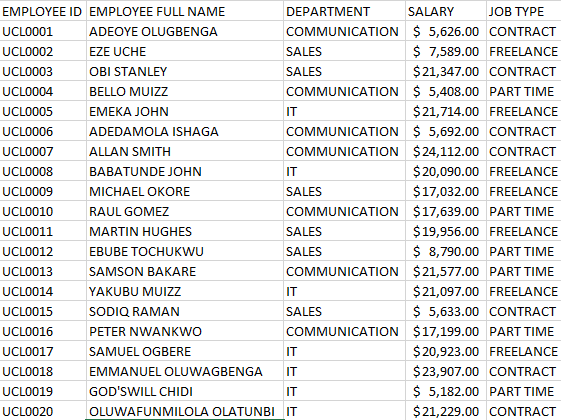
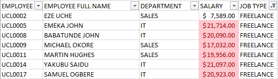
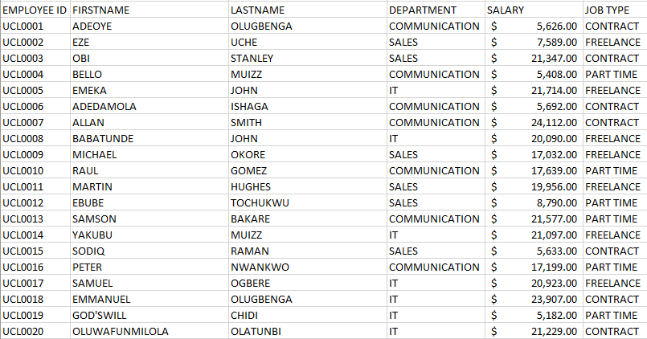
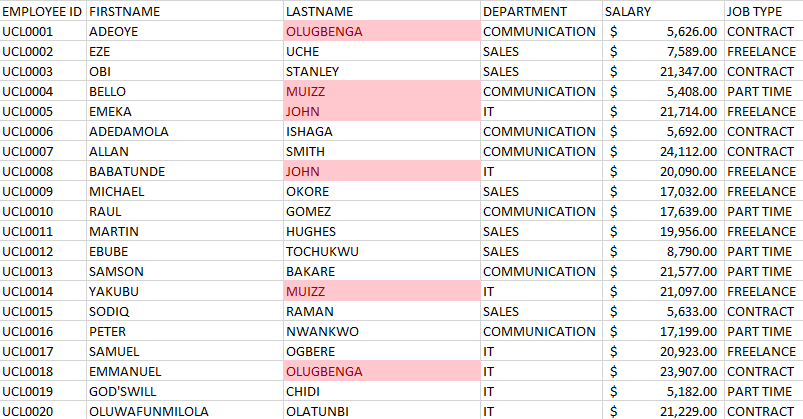

# Data-Analysis_Cohort-3_Task1
## Introduction
This is an Excel analysis of a dataset that I created. The dataset consists of 20 rows with various columns, including:
1.	Employee ID
2.	Employee Full Name - Comprising 20 random first and last names
3.	Departments - Categorized into Communications, Sales, and I.T.
4.	Salary - Ranging between $5000 to $25000
5.	Job Types - Including Part-time, Freelance, and Contract positions

.

## Problem statement
The tasks involved are:
1.	You’re to show only employees who are **_Freelancers_** and also highlight the employees whose salaries are above $10,000
2.	You’re to split the employees’ full names into first names and last names. Also, Check for duplicates and highlight if any, and don’t delete
3.	Highlight in yellow employees whose names begin with the letter **_E_** Format the Salary column such that the highest **_Salary_** has a green background and the lowest SALARY has a red background
   
# Skill/Concepts Demonstrated
1.	Data Management
2.	Data Manipulation
3.	Text-to-column
4.	Conditional formatting
5.	Use of advanced filtering options
   
## Solutions To the Above Task

# Task one: 
•	show only employees who are **_Freelancers_** 
•	highlight the employees whose salaries are above $10,000

# Applied steps:

•	Filter the Job type column using the dropdown bottom on the column and select Freelance. 

•	applied conditional formatting to highlight employees working as freelancers and earning above $10,000. Salaries above $10,000 are now highlighted in red.

Conditional formatting allows us to dynamically change the appearance of cells based on specified criteria. In this case, I used the **_greater than_** option to identify salaries above $10,000 

•	applied a red fill color to those cells. As a result, employees working as freelancers with salaries exceeding $10,000 is easily identifiable in the dataset.

## Task Two:
•	Split the employees’ full names into first names and last names,

•	Also, highlight and don’t delete duplicate if any.

# Applied Steps:

The dataset has been updated as follows:

•	The "Employee Full Name" column has been renamed to **_Firstname_**,

•	 An additional column has been created immediately after the **_Firstname_** column, named **_Lastname_**,

•	The **_Firstname_** column, which still contains the full names of employees, has been highlighted,

•	Text-to-Columns functionality was applied to split the names based on the _space_ character as the criteria for separation.
•	 As a result, the **_Firstname_** and **_Lastname_** are now in separate columns,

•	The "Firstname" and "Lastname" columns have been highlighted, and conditional formatting was applied to identify cells with duplicate values, representing employees with the same name.

•	Cells with duplicated names are highlighted in a light red color.

                     
Fullnames splitted 

Duplicate Names Highlighted

These changes and formatting help organize the dataset better and visually highlight employees with duplicate names for easy identification and analysis.

